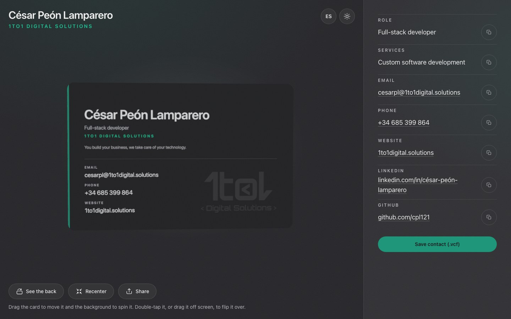

# contact-card

The contact card of César Peón Lamparero (1to1 Digital Solutions) in 3D. It
behaves like a paper business card handed over at a networking event: you grab
it, move it, spin it and flip it over, and you can save the details straight
to your address book.

Live at **https://card.1to1digital.solutions**.



## Running it

```bash
npm install
npm run dev      # http://localhost:3000 (set PORT to change it)
```

| Command             | What for                                           |
| ------------------- | -------------------------------------------------- |
| `npm run dev`       | Development server                                 |
| `npm run build`     | Production build                                   |
| `npm run typecheck` | Types (`tsc --noEmit`)                             |
| `npm run lint`      | ESLint                                             |
| `npm test`          | Unit tests (Vitest)                                |
| `npm run test:e2e`  | End-to-end tests (Playwright; builds and serves the site on port 3220) |

The first e2e run needs a browser: `npx playwright install chromium`.

Environment variables: see `.env.example`. There is only one,
`NEXT_PUBLIC_SITE_URL`, and it is optional: it sets the public origin used by
`metadataBase`, `robots.txt` and the sitemap, and only matters on preview
deployments, where it should point at the preview URL.

## Stack

Next.js 16 (App Router) · React 19 · TypeScript · Tailwind CSS 4 ·
three.js through React Three Fiber and drei · Vitest · Playwright.

## How it is laid out

```
app/                     Page, metadata, share image, robots and sitemap
components/contact-card/ The experience: scene, card, details panel and the flat fallback
components/geo/          Structured data (JSON-LD)
lib/                     Data, brand and pure logic, each with its tests beside it
e2e/                     Playwright tests against the built site
proxy.ts                 Content Security Policy with a per-request nonce
```

The contact details live in one place, `lib/contact.ts`, and from there they
reach the 3D card, the HTML panel, the vCard and the JSON-LD. The interface
copy lives in another: `lib/dictionary.ts`.

## Decisions worth knowing

- **Spanish and English, picked from the browser.** The language is negotiated
  on the server from `Accept-Language` (`lib/i18n.ts`), with no i18n library,
  and Spanish is the fallback when nothing matches. It travels resolved in the
  first HTML (unlike the theme, no script can fix it afterwards), so `/` is
  rendered on every request; the rest (share image, `robots.txt`, sitemap) is
  still generated at build time. The header button switches the language, meant
  for showing the card to someone who does not read yours, and the choice is
  remembered in a cookie the server reads before writing the text
  (`lib/request-language.ts`). The cookie wins over the header; any other value
  is ignored and the language is negotiated as usual.
- **The faces of the card are drawn on a 2D canvas** at runtime
  (`card-textures.ts`); they are not images. Changing a detail or a colour does
  not mean re-exporting any asset. The exception is the logos, which are the
  official brand SVGs (`public/logo-brand.svg` on the back; the positive or
  negative watermark on the front): they have to load first, so the face is
  drawn without them and refreshed as soon as they arrive.
- **Two themes, chosen by the button, not by the system.** The theme lives in
  the class of `<html>` and an inline script sets it before the first paint
  (`lib/theme.ts`). The page and the two faces of the card depend on it, and
  they always match.
- **No remote fonts.** The system font stack is used both in the interface and
  inside the card, so they match and nothing is downloaded.
- **No lanyard physics** (unlike Vercel's reference badge). The card moves on
  damped springs of our own (`lib/motion.ts`): pure code, with tests.
- **No cast shadow.** The card floats over a gradient, not against a wall; the
  bevel, the lights and the environment map give it its volume.
- **Everything works without WebGL.** If the browser cannot do 3D, the same
  card is shown in CSS. The details are always in HTML regardless.
- **Sharing goes through the system dialog** (`navigator.share`), the right
  path on a phone; where it does not exist, the link is copied with the same
  notice the copy buttons give. What gets shared is the card title in the
  language being viewed and the canonical address of the site, not whatever is
  in the address bar (`lib/share.ts`).
- **The link preview is generated from code too** (`app/opengraph-image.tsx`,
  with `ImageResponse`): same data and same palette as the card, so there is no
  PNG to re-export. Twitter/X reuses it. It comes in a single language (only the
  role and the tagline are translated in it) because the one asking for it is
  the messaging service, which sends nobody's language and caches one image per
  URL for everyone.
- **Security headers and a nonce-based Content Security Policy.** `next.config.ts`
  sets the static headers; `proxy.ts` sets the CSP with a nonce per request,
  which Next.js stamps on its own scripts and the layout passes to the theme
  script. Nothing is loaded from other origins at runtime.

## Interaction

| Gesture                                   | Result                                              |
| ----------------------------------------- | --------------------------------------------------- |
| Drag the card                             | Move it (it leans while moving)                     |
| Release                                   | It returns to the centre with inertia               |
| Drag the background                       | Spin it; on release it snaps into place             |
| Double-click / double-tap the card        | Flip it over                                        |
| Drag it off screen                        | Flip it over as well                                |
| "See the back" and "Recenter" buttons     | The same, from the keyboard                         |
| Shake the phone (after allowing motion)   | Flip it over; tilting the phone leans the card      |
| Sun/moon button in the header             | Switch between the light and the dark theme         |
| ES/EN button in the header                | Switch language; remembered                         |
| "See the details" (phone)                 | Open the sheet with the details, copy and save      |
| "Share"                                   | System dialog; where there is none, copy the link   |
| Move the mouse around the page            | The card leans towards the pointer without moving   |

When the page opens, the card drops in from off screen and sways once, so it
is obvious it can be picked up (`lib/card-intro.ts`). The sway stops at the
first gesture and does not come back. Whoever asks for reduced motion finds the
card already in place and still, without the lean towards the pointer.

On a narrow screen the card fills the viewport and there is no scrolling: the
details live in the sheet. From `lg` up they are always visible in the side
panel. A phone held sideways gets the card at full size, with the controls in
a column on the right edge.

## License

The code is under the [MIT License](LICENSE). The 1to1 Digital Solutions name
and logos, and the personal details in `lib/contact.ts`, are not: reuse the
code with your own brand and your own details.
